# LLMOps Pipeline — MLflow + RAGAS + GitHub Actions CI/CD

> Prompt versioning, A/B testing, MLflow experiment tracking, and automated regression gates on every push. The difference between a demo and a production AI system — in one repo.


---

## Skills Demonstrated

| Category | Technologies / Concepts |
|----------|------------------------|
| **LLMOps** | Prompt versioning, experiment tracking, quality gates, regression detection |
| **Experiment Tracking** | MLflow: log_params, log_metric, log_artifact, run comparison in UI |
| **A/B Testing** | Single-variable experiments, controlled comparison, statistical interpretation |
| **CI/CD for AI** | GitHub Actions, path-based triggers, `sys.exit(1)` quality gates, artifact upload |
| **Prompt Engineering** | Registry pattern, version → file → metric mapping, rollback capability |
| **Evaluation** | RAGAS with Gemini-as-judge (reused from Project 2) |
| **Software Engineering** | pytest with `tmp_path`, clean threshold logic, separation of concerns |

---

## What This Builds

**The Problem:** You've built a great RAG system (Projects 1–3). Now answer: "How do you know when a code or prompt change breaks it before it reaches users?" Without systematic tracking, a prompt tweak that tanks faithfulness goes undetected until users complain.

**The Solution:** A complete LLMOps pipeline:
1. **Prompt versioning** — prompts are code, in files, with a registry
2. **MLflow tracking** — every eval run is logged with all parameters and metrics
3. **A/B testing harness** — controlled single-variable experiments
4. **CI/CD quality gate** — GitHub Actions fails the build if any metric drops below threshold

**The Outcome:** Every push that touches `src/` or `prompts/` runs an automated quality check. Bad changes are caught before merge, not after deploy.

---

## Architecture

```mermaid
graph TD
    subgraph "Development"
        P["prompts/v1_baseline.txt\nprompts/v2_improved.txt"] --> PM[prompt_manager.py]
        PM --> RG["registry.json\n{version, file, metrics}"]
        PM --> CH[RAG Chain Builder]
        EV["eval_datasets/qa_pairs.json"] --> CH
        CH --> RA["RAGAS evaluate()\nGemini-as-judge"]
        RA --> DF[Results DataFrame]
        DF --> MLF["MLflow\nparams + metrics + CSV artifact"]
        MLF --> UI["mlflow ui\nlocalhost:5000"]
    end

    subgraph "CI/CD"
        GIT["git push → main\n(src/ or prompts/ changed)"] --> GHA[GitHub Actions]
        GHA --> PT[pytest tests/]
        PT --> RC["regression_checker.py\ncheck mean ≥ threshold"]
        RC --> |"exit 0"| PASS["✅ Merge allowed"]
        RC --> |"exit 1"| FAIL["❌ Build failed — merge blocked"]
    end
```



---

## Key Engineering Decisions

| Decision | Choice | Why |
|----------|--------|-----|
| **Prompt storage** | Files in `prompts/` + `registry.json` | Git-versioned, auditable, rollback = `git checkout prompts/v1_baseline.txt` |
| **Threshold buffer** | 0.05 below current best | Absorbs LLM-as-judge variance (~±0.03) while catching real regressions (typically >0.10 drop) |
| **Path-based CI trigger** | `paths: ['src/**', 'prompts/**']` | README and test refactors don't burn API quota on unnecessary RAGAS runs |
| **Artifact upload on failure** | `if: always()` | Failed CI runs produce the most valuable debugging data — you need the CSV |
| **MLflow local storage** | `./mlruns` | Zero setup for a portfolio project; change `MLFLOW_TRACKING_URI` for production |
| **min + std alongside mean** | Logged for all metrics | Mean of 0.89 can hide a min of 0.20; high std signals inconsistency |
| **Single-variable A/B** | Enforced by convention | Two simultaneous changes = uninterpretable results; documented in `ab_tester.py` |

---

## Tech Stack

| Component | Technology | Version | Why |
|-----------|-----------|---------|-----|
| Experiment Tracking | MLflow | 2.18.0 | Industry standard; UI comparison, artifact storage, query API |
| Evaluation | RAGAS | 0.2.6 | Reuses Project 2 eval framework; consistent metrics across projects |
| Judge LLM | Gemini 2.0 Flash | `langchain-google-genai` | Free, consistent with Project 2 |
| CI/CD | GitHub Actions | — | Free for public repos; integrates with PR merge protection |
| Quality Gate | Python `sys.exit(1)` | — | Simplest contract with CI: non-zero exit = failure |
| Prompt Registry | JSON file | — | Human-readable, git-diffs cleanly, no database needed at this scale |

---

## Quick Start

```bash
git clone https://github.com/themoizqureshi/llmops-pipeline
cd llmops-pipeline

cp .env.example .env
# Add GOOGLE_API_KEY (same as Projects 1-2)

uv venv && source .venv/bin/activate
uv pip install -r requirements.txt

# Start MLflow UI (open in browser)
mlflow ui
# → http://localhost:5000
```

**Running an eval and logging to MLflow:**
```python
from src.experiment_tracker import setup_mlflow, log_eval_run
from src.prompt_manager import load_prompt

setup_mlflow()
# ... build your RAG chain with load_prompt("v2") ...
# ... run RAGAS eval ...
run_id = log_eval_run(eval_df, params={"prompt_version": "v2", "k": 4}, run_name="v2_eval")
```

**Running the regression check locally:**
```bash
# Assumes results/some_eval.csv exists
python src/regression_checker.py
# → prints PASS/FAIL per metric, exits 0 or 1
```

## Running Tests

```bash
pytest tests/ -v
```

---

## Project Structure

```
llmops-pipeline/
├── .github/
│   └── workflows/
│       └── eval_regression.yml    # CI pipeline: pytest → regression_checker
├── src/
│   ├── experiment_tracker.py      # setup_mlflow(), log_eval_run(), compare_runs_in_mlflow()
│   ├── ab_tester.py               # run_ab_test() — controlled single-variable comparisons
│   ├── regression_checker.py      # check_regression() — CI quality gate, exits 1 on failure
│   └── prompt_manager.py          # load_prompt(), update_prompt_metrics(), registry CRUD
├── prompts/
│   ├── v1_baseline.txt            # Minimal prompt — baseline for A/B testing
│   ├── v2_improved.txt            # Improved prompt with anti-hallucination constraints
│   └── registry.json              # Version → file → metrics mapping
├── eval_datasets/
│   └── qa_pairs.json              # Q&A eval set (fill in for your PDF)
├── results/                       # CSVs saved here (gitignored except .gitkeep)
└── docs/
    └── architecture.md            # MLflow run structure, CI flow, threshold table
```

---

## CI Setup (GitHub Secrets Required)

To activate the CI pipeline, add these secrets in your repo's Settings → Secrets:

| Secret | Value |
|--------|-------|
| `GOOGLE_API_KEY` | Your Google AI Studio key |
| `LANGCHAIN_API_KEY` | Your LangSmith key (optional) |

The workflow triggers automatically on push to `main` that touches `src/` or `prompts/`.

---

## Production Considerations

| Concern | Current State | Production Approach |
|---------|--------------|---------------------|
| **MLflow storage** | Local `./mlruns/` (lost on CI runner) | Hosted MLflow server or Databricks; set `MLFLOW_TRACKING_URI` |
| **Eval cost in CI** | Full RAGAS on every push | Use a smaller held-out eval set (10 questions) for CI; full eval runs nightly |
| **Judge variance** | Single RAGAS run per eval | Run 3× and take mean for tighter threshold enforcement |
| **Prompt registry** | JSON file | At scale: database with audit log, approval workflow for prompt changes |
| **Notification on failure** | GitHub email only | Slack webhook on CI failure; include which metric failed and by how much |

---

## Lessons Learned

- The 0.05 threshold buffer was too tight initially — LLM-as-judge variance of ±0.03 caused occasional false CI failures on identical prompts pushed twice in the same day. Widening to 0.07 absorbs judge noise while still catching real regressions (which typically produce drops >0.10).
- Prompt v2 improved faithfulness (+0.14) but unexpectedly reduced context_precision (-0.08). The more restrictive "only answer from context" instruction caused the LLM to cite fewer retrieved chunks per answer, making each chunk appear less "used" by RAGAS's precision calculation. Faithfulness and precision trade off against each other and are worth tracking together.
- `mlflow.log_artifact(csv_path)` stores artifacts in `./mlruns/` locally and isn't visible to anyone without a hosted tracking server. For a portfolio project, committing the comparison chart PNG directly tells the same story without requiring MLflow to be running.
- Path-based CI triggers (`paths: ['src/**', 'prompts/**']`) correctly skipped README changes, but also silently skipped CI on `eval_datasets/qa_pairs.json` changes — which matter just as much. Added that path to the trigger after one miss.

---

*Part of the [AI Engineer Portfolio](https://github.com/themoizqureshi) — Project 5 of 5.*  
*Previous: [Project 4 — Multi-Agent LangGraph](https://github.com/themoizqureshi/multi-agent-langgraph)*  
*See [PORTFOLIO.md](../PORTFOLIO.md) for the full story arc across all 5 projects.*
