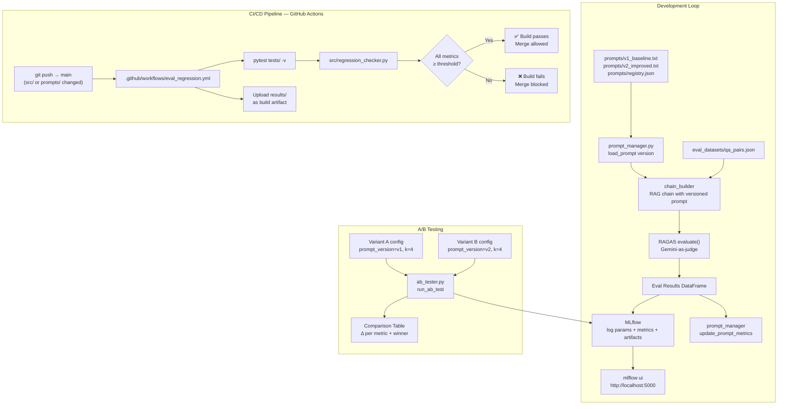

# Architecture — LLMOps Pipeline

## System Overview



## CI Quality Thresholds

| Metric | Threshold | Rationale |
|--------|-----------|-----------|
| `faithfulness` | ≥ 0.75 | Below this, the LLM is hallucinating too often to be trusted |
| `answer_relevancy` | ≥ 0.70 | Below this, too many answers miss the actual question |
| `context_recall` | ≥ 0.65 | Below this, retrieval is missing too much relevant information |
| `context_precision` | ≥ 0.65 | Below this, too much noise is being injected into the context |

## Prompt Versioning Model

```
prompts/
├── v1_baseline.txt      ← minimal prompt, no anti-hallucination constraints
├── v2_improved.txt      ← adds ONLY-context constraint, direct answer instruction
└── registry.json        ← maps versions → files → eval scores
                            tracks which version is "current_production"
```

Every prompt change:
1. Creates a new numbered file (`v3_*.txt`)
2. Adds an entry to `registry.json`
3. Runs through the eval pipeline before being deployed
4. Gets its scores written back to `registry.json` via `update_prompt_metrics()`

## MLflow Run Structure

Each `log_eval_run()` call creates one MLflow run with:

```
Run: "v2_tighter_prompt"
├── Params
│   ├── prompt_version: v2
│   ├── model: gemini-2.0-flash
│   ├── chunk_size: 1000
│   └── k: 4
├── Metrics
│   ├── mean_faithfulness: 0.89
│   ├── min_faithfulness: 0.72
│   ├── std_faithfulness: 0.08
│   └── ... (same for all 4 metrics)
├── Artifacts
│   └── v2_tighter_prompt_results.csv
└── Tags
    ├── dataset_size: 25
    └── environment: development
```
